Architecture · Intent & ECO

# Execution Context Object (ECO)

The ECO is the **machine-readable contract** that carries evidence from the knowledge layer into lane classification, decomposition, execution, and trace logging. It is the bridge between knowledge and execution.

> The ECO contains **hard constraints** (`forced_lane_minimum`, `forced_retrieval_mode`, `forced_unknown`) that the pipeline **must** obey. The pipeline can escalate above constraints — it can **never** downgrade below them.

---

## Full Schema

| Field | Type | Description |
|---|---|---|
| `query` | `string` | Original requirement or feature description |
| `intent` | `object` | `{ primary, secondary?, composite: bool, retrieval_strategy, constraint_rule }` |
| `entity_scope` | `string[]` | Identified entities: module names, file paths, symbol names |
| `modules_touched` | `string[]` | Modules the knowledge layer determined are affected |
| `dependency_depth` | `integer` | Maximum hop count in the dependency chain |
| `cross_module_edges` | `object[]` | Cross-module dependency edges: `{from, to, edge_type, weight}` |
| `critical_path_hit` | `boolean` | Whether any file in `.ai/critical-paths.txt` is affected |
| `hub_nodes_in_path` | `string[]` | Hub nodes (>50 edges) in the dependency chain |
| `eco_dimensions` | `object` | Five reliability dimensions (Coverage · Freshness · Mapping · Conflict · Graph) |
| `evidence_checkpoints` | `object` | Binary pass/fail per intent with provenance |
| `freshness` | `object` | `{index_commit, head_commit, delta, lsp_state, delta_status}` |
| `confidence_score` | `integer` | 0–100, from penalty matrix |
| `penalties` | `object[]` | Each penalty: `{rule, deduction, detail}` |
| `conflicts` | `object[]` | Spec/code conflicts detected with resolution status |
| `forced_lane_minimum` | `enum` | `A \| B \| C` — lowest lane evidence permits |
| `forced_retrieval_mode` | `enum` | `index_only \| dual_mode` |
| `forced_unknown` | `boolean` | If `true`, pipeline must not proceed to automated planning |
| `escalation_reasons` | `string[]` | Why forced constraints were set |
| `recommended_lane` | `enum` | `A \| B \| C` |
| `recommended_strategy` | `enum` | `additive \| refactor \| migration \| parallel_path \| flag_first` |
| `boundary_warnings` | `string[]` | What the knowledge layer cannot answer |
| `unobservable_factors` | `string[]` | Feature flags, runtime config, external APIs |
| `suggested_next` | `object` | `{action, reason}` — confidence-gated |
| `mapping` | `object` | Mapping quality details with ranked alternatives |

---

## Constraint Enforcement Rules

| Evidence condition | Forced constraint |
|---|---|
| `modules_touched.length > 2` | `forced_lane_minimum: C` |
| `critical_path_hit == true` | `forced_lane_minimum: C`, `forced_retrieval_mode: dual_mode` |
| `evidence_completeness == insufficient \| unknown` | `forced_unknown: true` |
| `confidence_score < 40` | `forced_unknown: true` |
| `degradation_tier >= 3` | `forced_lane_minimum: B`, `forced_retrieval_mode: dual_mode` |
| `conflicts.length > 0` (unresolved) | `forced_lane_minimum: B` |

:::danger Override policy
Only a human running `dev override --reason "..."` can bypass forced constraints. The override, reason, and identity are always logged.
:::

---

## ECO Construction Flow

```mermaid
flowchart LR
    classDef parse fill:#0D0D0D,stroke:#0D0D0D,color:#fff
    classDef eco   fill:#D63318,stroke:#D63318,color:#fff
    classDef gate  fill:#2A2A2A,stroke:#2A2A2A,color:#fff

    A["Intent detected\nheuristic, no LLM"]:::parse
    B["Intent-biased retrieval\nrouter flags + concurrent fan-out"]:::parse
    C["Spec/code collision\nconflict resolution"]:::parse
    D["5 ECO dimensions\nCoverage · Freshness · Mapping\nConflict · Graph"]:::eco
    E["Causal clustering\nbefore counting"]:::eco
    F["Confidence scoring\n100 − Σ deductions"]:::eco
    G["Constraint enforcement\nforced_lane · forced_mode · forced_unknown"]:::eco
    H["Evidence checkpoints\nbinary pass/fail per intent"]:::gate
    I["ECO emitted\nto pipeline"]:::gate

    A --> B --> C --> D --> E --> F --> G --> H --> I
```

---

## Spec / Code Conflict Resolution

| Conflict | Resolution | Rationale |
|---|---|---|
| Spec references file/module that doesn't exist | Flag to developer. Code is ground truth for what exists. | Spec is stale |
| Spec describes a flow that differs from code | Escalate to developer. Present both. | Only the developer knows which is correct |
| Spec says modify but target is in critical-paths | Code constraints win. Escalate to Lane C. | Architectural constraints exist for safety |
| Spec scope narrower than codebase evidence | Codebase wins. ECO includes full affected set with `boundary_warning`. | Developer may not know full dependency chain |
| Spec scope broader than codebase (modules don't exist) | Flag as partial. Distinguish modify-existing vs create-new. | Spec may be planning ahead |
