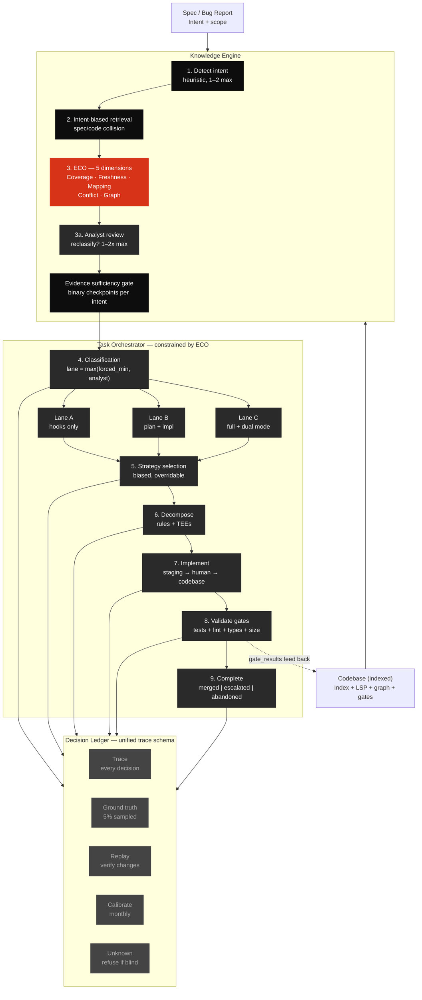

v9.0 — Final Architecture · March 2026

# System Overview

AI Delivery OS is a **three-layer operating system** for AI-assisted software delivery. It governs how AI agents plan, implement, and validate code changes by providing structured evidence from the codebase, constraining agent decisions based on that evidence, and recording every decision for debugging and calibration.

:::info The Central Principle
The system is **not an autonomous agent**. It is a decision-support tool that reduces the probability of wrong plans by giving AI agents grounded, reliability-scored context — and constraining them to operate within evidence-backed boundaries.
:::

---

## Three Layers

  

    Layer 01
    <h3 style={{textTransform:'uppercase',fontWeight:900,fontSize:'1.2rem',margin:'0 0 0.75rem'}}>Knowledge Engine</h3>
    
Builds structured evidence from the codebase. Parses code, indexes modules, traces dependencies, detects patterns, and produces a reliability-scored <strong>Execution Context Object (ECO)</strong> for every task.

  

  

    Layer 02
    <h3 style={{textTransform:'uppercase',fontWeight:900,fontSize:'1.2rem',margin:'0 0 0.75rem'}}>Task Orchestrator</h3>
    
Turns requirements into bounded execution slices. Classifies work into lanes, selects strategies, decomposes tasks, and assigns scoped boundaries to each implementer agent. Constrained by the ECO.

  

  

    Layer 03
    <h3 style={{textTransform:'uppercase',fontWeight:900,fontSize:'1.2rem',margin:'0 0 0.75rem'}}>Decision Ledger</h3>
    
Records why the system believed something, chose something, and did something. A unified trace schema spans all stages. Operational contracts enable continuous improvement.

  

---

## Dual Inputs

Every task has two inputs of **equal weight**:

| Input | What it provides | Authority |
|---|---|---|
| **Spec file** | Intent · scope · acceptance criteria · risk notes | What the developer *wants* |
| **Codebase** | Modules · dependencies · graph edges · patterns · gate results | What actually *exists* |

The knowledge layer's job is to **resolve the spec's intent against the codebase's reality**. The Execution Context Object (ECO) is the output of that collision.

---

## End-to-End Flow

---

## Key Numbers

  

    
0

    LLM calls for Lane A — 80% of all commits. Truly invisible.
  

  

    
5

    ECO reliability dimensions. Each graduates to warn · escalate · block.
  

  

    
~200ms

    Post-commit index latency. Atomic. Silent. Every commit.
  

---

## What the System Does Not Do

The knowledge layer **does not understand code**. It retrieves structural facts, measures its own reliability, and communicates its limits. The reasoning happens in the LLM that consumes the ECO — the knowledge layer provides the evidence.

See [Design Boundaries](/docs/architecture/design-boundaries) for the full list of known limitations and gaps.
