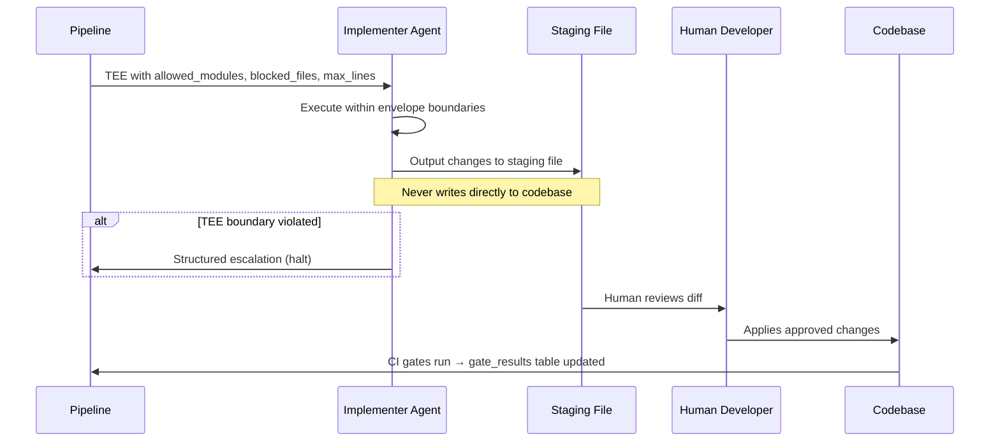

<span class="u-eyebrow">Task Pipeline · Layer 02</span>

# Task Execution Envelope (TEE)

After decomposition, each slice receives a **Task Execution Envelope** that tells the implementer agent exactly what it can and cannot do. The implementer outputs to a **staging file** — not the codebase. The human applies changes they agree with.

:::info Escalation rule
If the implementer detects it needs to violate any TEE boundary, it **stops** and returns a structured escalation. It never proceeds silently outside its envelope.
:::

---

## TEE Field Reference

| Field | Description |
|---|---|
| `slice_id` | Unique identifier for this task slice |
| `lane` | `A \| B \| C` — inherited from ECO classification |
| `strategy` | From strategy selection step |
| `description` | What this slice should accomplish |
| `allowed_modules` | Modules this slice may modify. Changes outside → rejected |
| `allowed_files` | Specific files (empty = any within modules) |
| `blocked_files` | Files the implementer **must not** touch |
| `max_lines` | Maximum diff size (300–500 depending on strategy) |
| `retrieval_mode` | `index_only \| dual_mode` (from ECO) |
| `context_packet` | Filtered context relevant to this slice only |
| `patterns_to_follow` | Canonical pattern names for compliance |
| `gate_failures_in_scope` | Existing test failures in allowed files |
| `tests_required` | Boolean — always `true` for Lane B/C |
| `test_scope` | `unit \| unit+integration` |
| `review_type` | `ci_only \| analyst_review \| specialist_review` |
| `escalation_conditions` | When to halt and return to analyst |
| `confidence_at_planning` | ECO confidence when plan was made. If implementer re-queries and confidence drops >15 points: escalate. |

---

## Strategy Selection Matrix

| Intent | Default strategy | Also permitted | Never permitted |
|---|---|---|---|
| `bug_fix` | refactor-in-place | additive (if fix requires new code) | migration, parallel_path |
| `new_feature` | additive, flag-first | refactor, migration | *(all valid)* |
| `refactor` | refactor-in-place | migration, parallel_path | additive |
| `dep_update` | migration | parallel_path | additive |
| `quick_fix` | none (Lane A) | refactor-in-place if escalated | migration, parallel_path |

The analyst can choose any **permitted** strategy with a logged justification. Strategy overrides are recorded in the decision trace.

---

## Decomposition Rules

```
Max slice size:   300–500 lines (strategy-dependent)
Scope:            Single module per slice
Testability:      Each slice must be independently testable
Composite slices: Tagged by which intent they serve
                  Each slice has its own TEE boundaries
```

---

## Staging Flow


